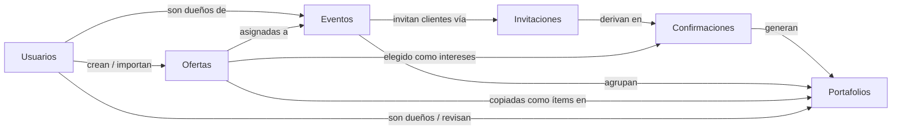
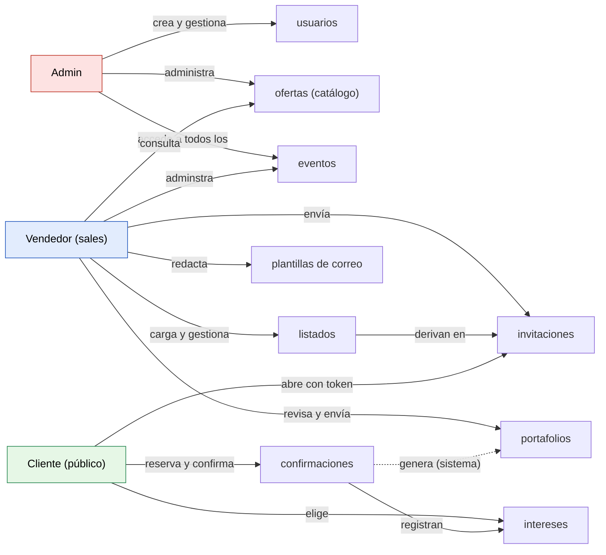
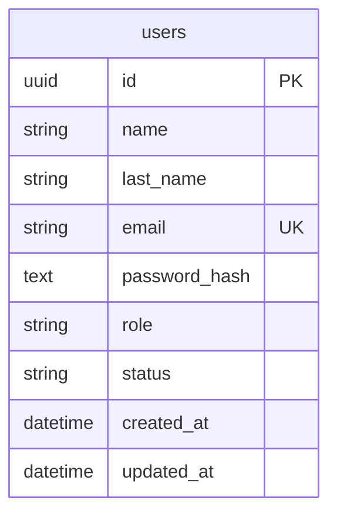
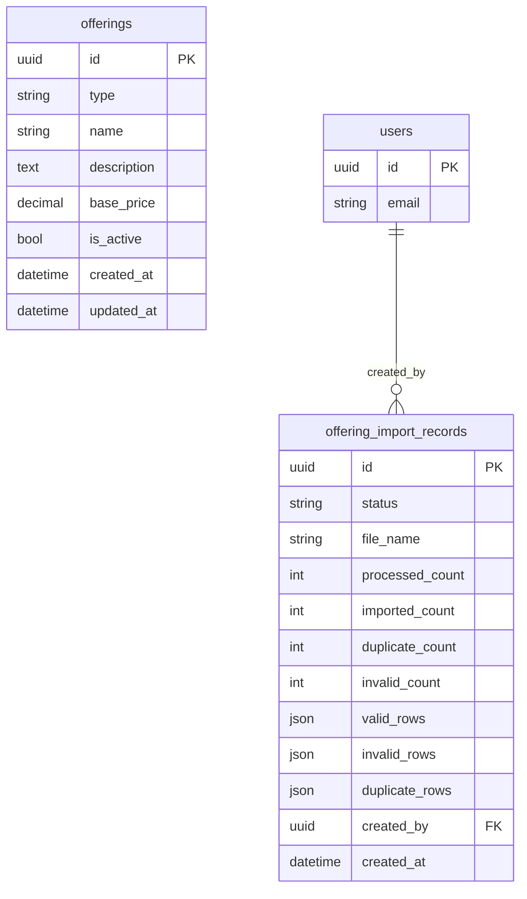
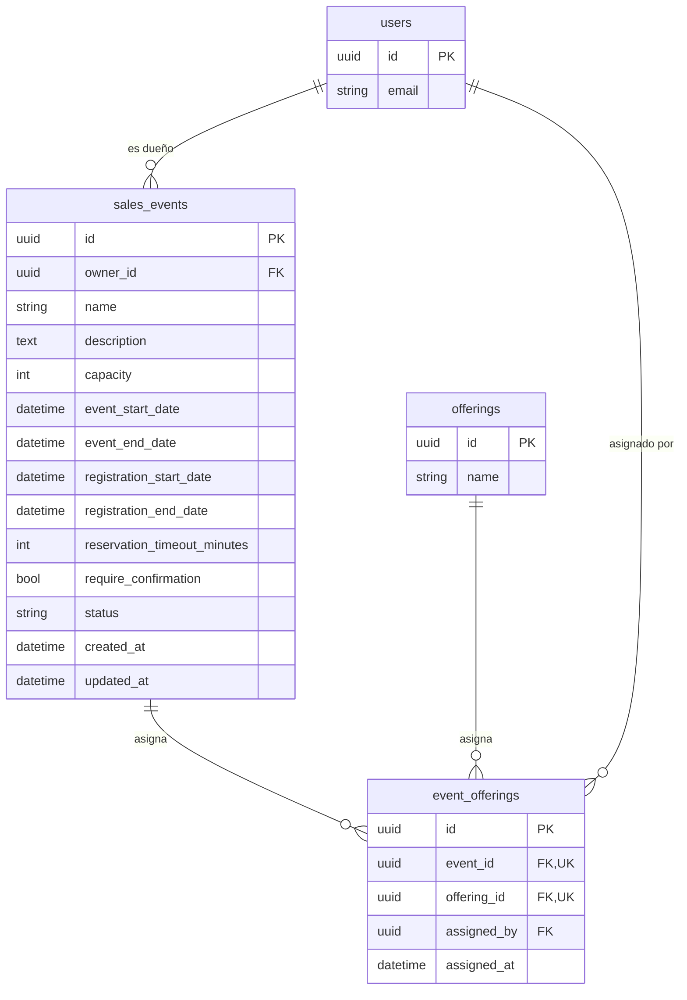
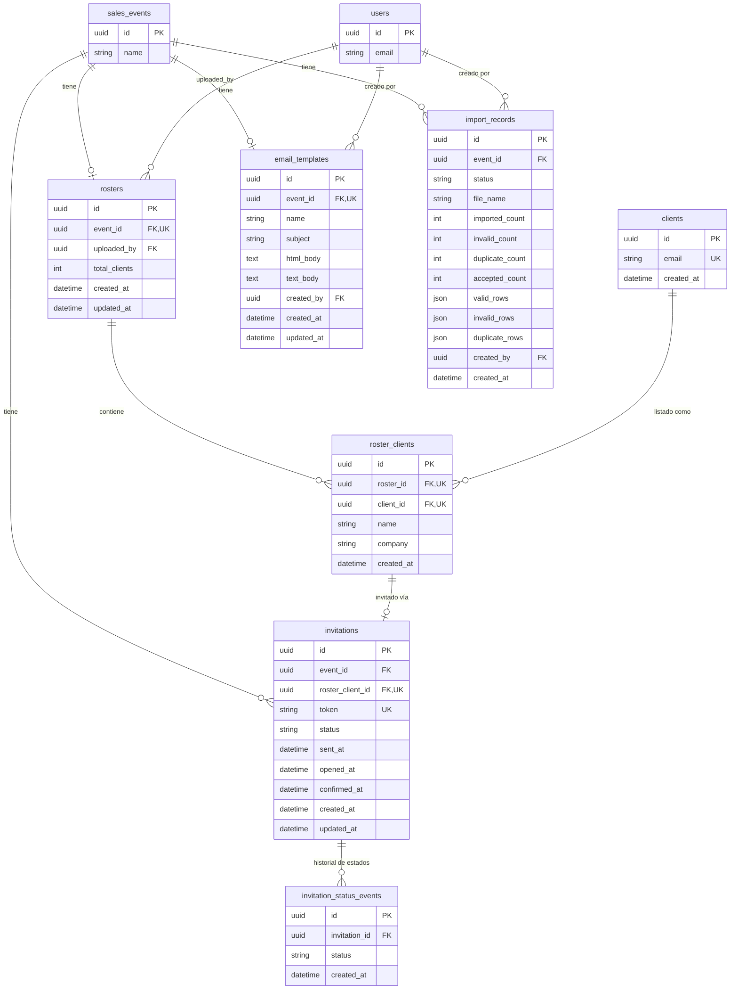
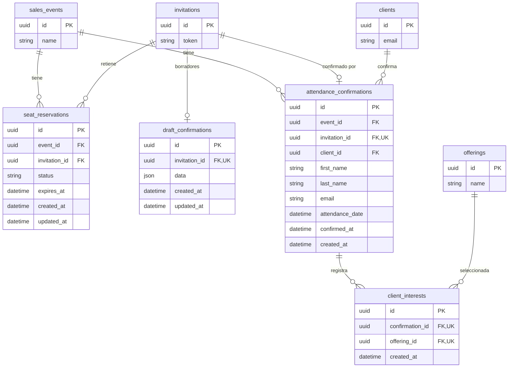
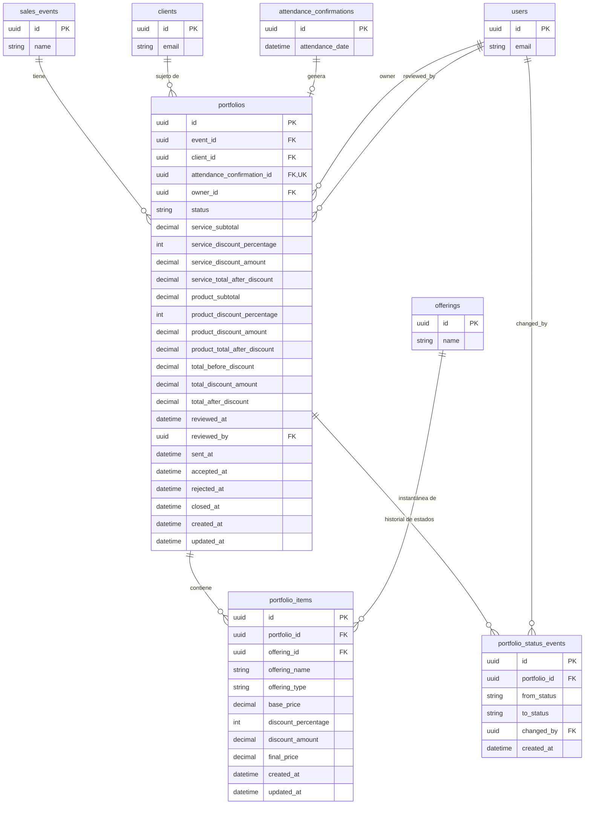

# Diagramas ER de la Base de Datos

El esquema está organizado en seis dominios lógicos. El diagrama siguiente muestra cómo se relacionan a alto
nivel; cada sección posterior profundiza en un dominio con el detalle completo de sus tablas.

## Usuarios

Los clientes son considerados usuarios publicos, no tienen registros en la base de datos.

## Catálogo de Productos y Servicios

## Gestión de Eventos Promocionales

## Invitaciones de Clientes y Gestión del Listado

## Confirmación de Asistencia del Cliente y Recolección de Intereses

El flujo paso a paso de este proceso (abrir invitación, reservar asiento, borrador y confirmación) está
documentado en [`flows.md`](./flows.md#confirmación-de-asistencia). Aquí se muestra solo el modelo de datos.

## Gestión de Portafolios Promocionales

