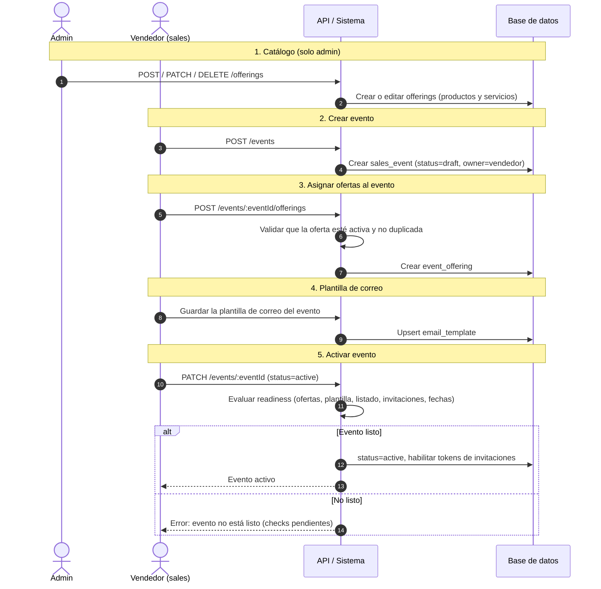
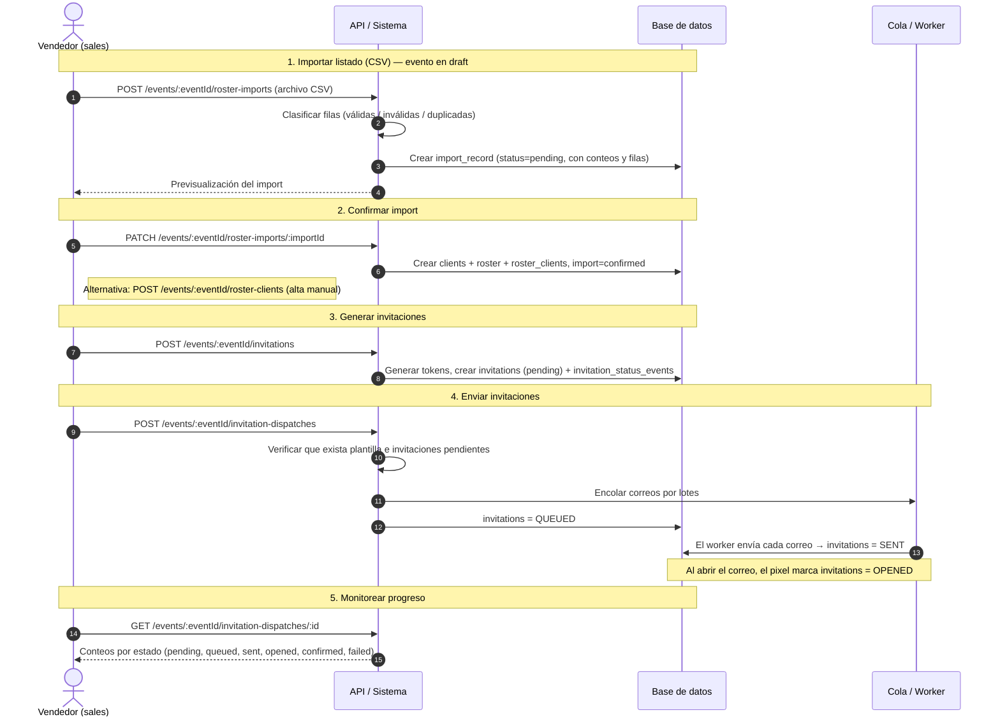
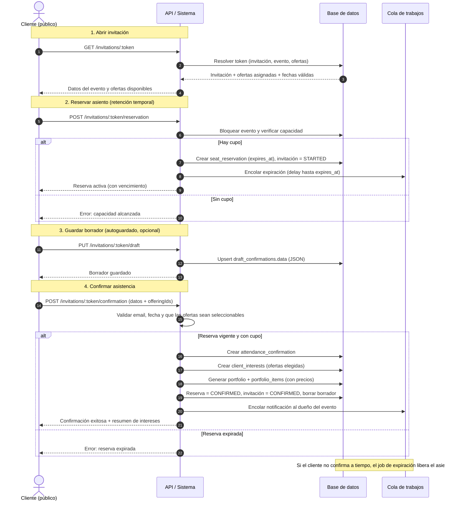
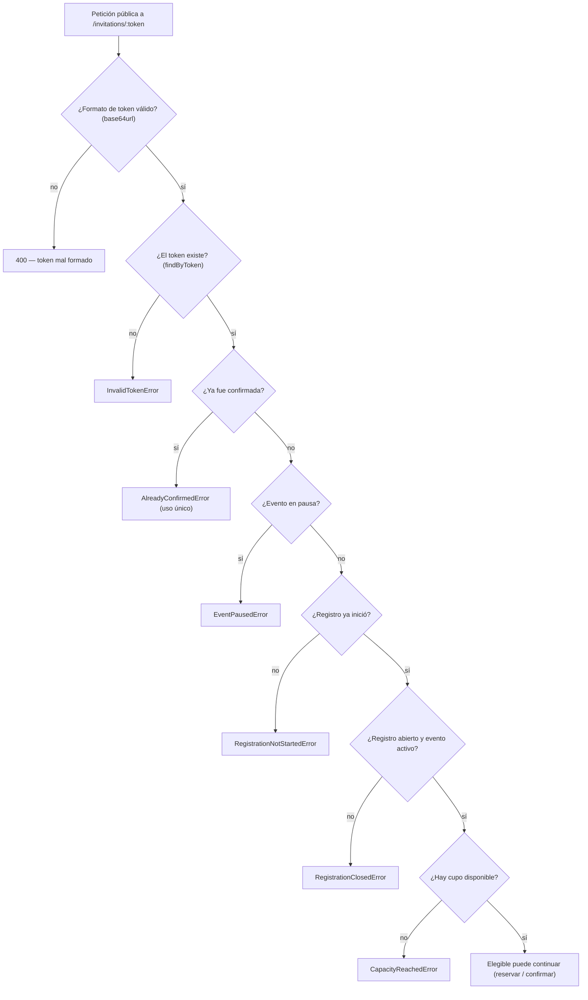
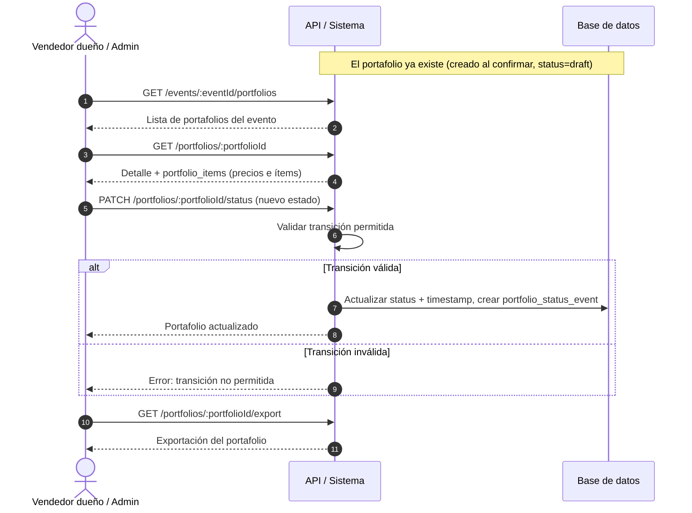
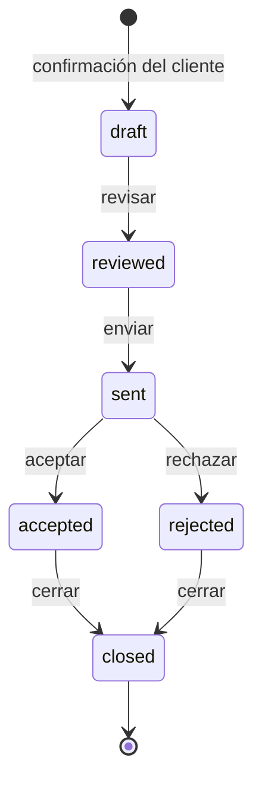

# Flujos del Sistema

Diagramas de los flujos principales (secuencia y estados).

## Tabla de Contenidos

- [Configuración del evento](#configuración-del-evento) catálogo, asignación de ofertas y activación.
- [Listado e invitaciones](#listado-e-invitaciones) carga de clientes y envío de correos.
- [Acceso público por token](#acceso-público-por-token) cómo se valida el token y la elegibilidad.
- [Confirmación de asistencia](#confirmación-de-asistencia) flujo público del cliente, vía token.
- [Gestión del portafolio](#gestión-del-portafolio) revisión, envío y cambios de estado.

## Configuración del evento

Preparación del evento por parte del staff: el **admin** mantiene el catálogo (solo lectura para el vendedor)
y el **vendedor** crea su evento, le asigna ofertas, redacta la plantilla de correo y lo activa. La activación
requiere pasar las verificaciones de _readiness_; recién ahí los tokens de invitación quedan habilitados.

## Listado e invitaciones

El vendedor carga el listado de clientes (CSV o alta manual), genera las invitaciones con su token único y las
envía por correo de forma asíncrona. La importación solo se permite con el evento en `draft`.

## Confirmación de asistencia

Flujo público (sin autenticación, vía token de la invitación)

### Acceso público por token

El cliente no inicia sesión: el `token` de la invitación **es la credencial**. Se genera con 256 bits de
aleatoriedad, es **único e indexado** en `invitations.token` y viaja en el
enlace del correo. Todas las rutas bajo `/invitations/:token` son **públicas** (sin `AuthMiddleware`): quien
tenga el token puede operar sobre esa invitación.

En cada petición, antes de actuar, el sistema valida el formato del token, lo resuelve contra la base y aplica
una **puerta de elegibilidad**. Además, al confirmar, el email enviado debe coincidir con el del cliente
invitado (vincula el token a la persona). El token **no tiene expiración propia**: su validez está acotada por
el estado del evento y la ventana de registro, y por el uso único (una vez confirmada, no se reutiliza).

## Gestión del portafolio

El portafolio se crea automáticamente al confirmar el cliente (en estado `draft`). A partir de ahí, el
**vendedor dueño** (o un **admin**) lo revisa, lo envía y registra el desenlace. Cada cambio de estado valida
la transición permitida y queda asentado en `portfolio_status_events`.

Ciclo de vida del estado del portafolio (transiciones permitidas):

